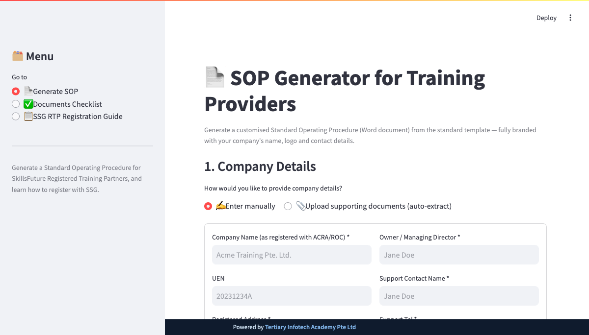

<div align="center">

# 📄 SSG SOP Generator for Training Providers

[](https://www.python.org/)
[](https://streamlit.io/)
[](https://python-docx.readthedocs.io/)
[](https://graphviz.org/)
[](LICENSE)

**Generate a fully-branded Standard Operating Procedure (SOP) Word document for SkillsFuture Singapore (SSG) Registered Training Partners — in seconds.**

[Report Bug](https://github.com/alfredang/ssg-ato-generator/issues) · [Request Feature](https://github.com/alfredang/ssg-ato-generator/issues)

</div>

## Screenshot



## About

The **SSG SOP Generator** turns a placeholder-only SOP template into a complete, company-branded *Training Systems and Capabilities* Standard Operating Procedure — suitable for the **Policy & Operations Manual** requirement of an SSG Organisation Registration (OR) application.

Enter your company details manually, or upload supporting documents (e.g. an ACRA business profile) and let the app extract them. The app fills the template, regenerates clean org charts and process flowcharts with your details, optionally adds your logo, and outputs `SOP_<Company Name>.docx`.

### Key Features

| Feature | Description |
|---------|-------------|
| 📝 **Two input modes** | Enter company details manually, **or** upload supporting documents and auto-extract company name, UEN, address and contact |
| 🧩 **Placeholder template** | A single, reusable SOP template containing *zero* real company/personal data — only `{{placeholders}}` and `[[DIAGRAM:markers]]` |
| 📊 **Auto-generated diagrams** | 2 org charts + 5 process flowcharts (enquiry, funding, course confirmation, refund, trainer performance), redrawn cleanly with **Graphviz** and branded per company |
| 🖼️ **Logo toggle** | Show or hide a company logo on the cover page |
| 📄 **Clean Word output** | Cover page, version-control record, auto-updating Table of Contents, sections A–D, and a company-name footer — exported as `SOP_<Company>.docx` |
| ✅ **Documents checklist** | Interactive checklist of the 5 OR document sets (ACRA, Finance, Training Facilities, Training Records, SOP) + downloadable Training Record template |
| 📋 **SSG RTP guide** | Visual summary of the Organisation Registration requirements, supporting documents, fees, and an application-flow diagram |

## Tech Stack

| Category | Technologies |
|----------|--------------|
| **Frontend / App** | Streamlit |
| **Document Generation** | python-docx |
| **Diagrams** | Graphviz (`dot`) |
| **Document Extraction** | pdftotext (poppler), pypdf, openpyxl |
| **Imaging** | Pillow |
| **Tooling** | uv (dependency & venv management) |
| **Verification (optional)** | LibreOffice (`soffice`) for rendering `.docx` → PDF |

## Architecture

```
┌──────────────────────────────────────────────────────────────┐
│                      app.py  (Streamlit UI)                    │
│   📄 Generate SOP   │   ✅ Documents Checklist   │   📋 RTP Guide │
└───────┬──────────────────────┬───────────────────────┬─────────┘
        │ company details      │ checklist + xlsx       │ guide + flow
        ▼                      ▼                         ▼
┌──────────────┐      ┌──────────────────┐     assets/rtp_application.png
│ extraction.py│      │ sop_generator.py │
│ (ACRA/PDF →  │─────▶│  fill engine     │
│  fields)     │      │                  │
└──────────────┘      │  • {{tokens}}    │
                      │  • {{LOGO}}      │
                      │  • [[DIAGRAM]]   │
                      └───┬──────────┬───┘
                          │          │
              loads       │          │ regenerates per-company
                          ▼          ▼
                 sop_template.docx   flowcharts.py  (Graphviz)
                 (build_template.py)  org charts + flowcharts
                          │
                          ▼
                  SOP_<Company>.docx
```

The pipeline is **template + markers + per-company diagram regeneration**: the shipped template is generic, and the owner/company name is injected into diagrams only at generation time.

## Project Structure

```
ssg-ato-generator/
├── app.py                 # Streamlit UI (3 pages + footer)
├── sop_generator.py       # Fill engine: placeholders, logo, diagram insertion
├── build_template.py      # Authors the placeholder sop_template.docx
├── flowcharts.py          # Graphviz org charts + flowcharts (parameterised by owner)
├── extraction.py          # Extract company info from uploaded PDFs/DOCX
├── sop_template.docx       # The generated placeholder template
├── assets/
│   ├── Training_Record_Template.xlsx   # Downloadable SSG track-record template
│   └── rtp_application.png             # Static RTP application-flow diagram
├── pyproject.toml
└── CLAUDE.md
```

## Getting Started

### Prerequisites

- **Python 3.10+**
- **[uv](https://github.com/astral-sh/uv)** for dependency management
- **Graphviz** (`dot`) — required to render diagrams
  ```bash
  brew install graphviz          # macOS
  # sudo apt-get install graphviz  # Debian/Ubuntu
  ```
- **poppler** (`pdftotext`) for document extraction — optional but recommended
  ```bash
  brew install poppler
  ```

### Installation & Run

```bash
git clone https://github.com/alfredang/ssg-ato-generator.git
cd ssg-ato-generator

uv sync                         # install dependencies

# Ensure Graphviz is on PATH, then launch
export PATH="/opt/homebrew/bin:$PATH"
uv run streamlit run app.py
```

Open http://localhost:8501 in your browser.

### Regenerating the template / diagrams

```bash
uv run python build_template.py                       # rebuild sop_template.docx
uv run python flowcharts.py /tmp/diagrams             # render all diagrams
uv run python -c "import flowcharts; flowcharts.rtp_application('assets')"  # RTP flow image
```

## Deployment

The app is a standard Streamlit application and can be deployed to any host that supports Python + a Graphviz system package (Streamlit Community Cloud, a Docker container, Hugging Face Spaces, etc.). Ensure `graphviz` (and optionally `poppler-utils`) are installed as system packages in the deployment image.

## Contributing

1. Fork the repository
2. Create a feature branch (`git checkout -b feature/my-feature`)
3. Commit your changes
4. Open a Pull Request

## Developed By

**Tertiary Infotech Academy Pte. Ltd.** — [tertiaryinfotech.com](https://www.tertiaryinfotech.com/)

## Acknowledgements

- [SkillsFuture Singapore (SSG) — TPGateway](https://www.tpgateway.gov.sg/) for the Organisation Registration requirements
- [Streamlit](https://streamlit.io/), [python-docx](https://python-docx.readthedocs.io/), and [Graphviz](https://graphviz.org/)

---

<div align="center">

⭐ If you find this useful, please star the repo!

</div>
